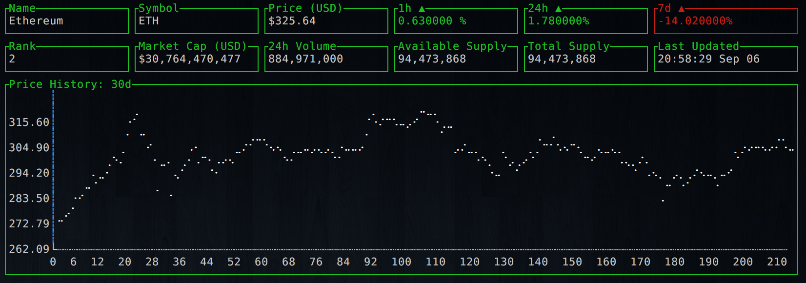

# cryptodash

> Cryptocurrency information and charts displayed in a dashboard from your terminal.



# Install

```bash
go get -u github.com/miguelmota/cryptodash/cryptodash
```

# Usage

```bash
$ cryptodash {coin}
```

Example

```bash
$ cryptodash ethereum
```

# License

MIT
