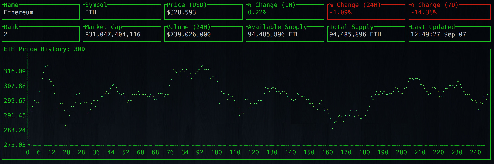
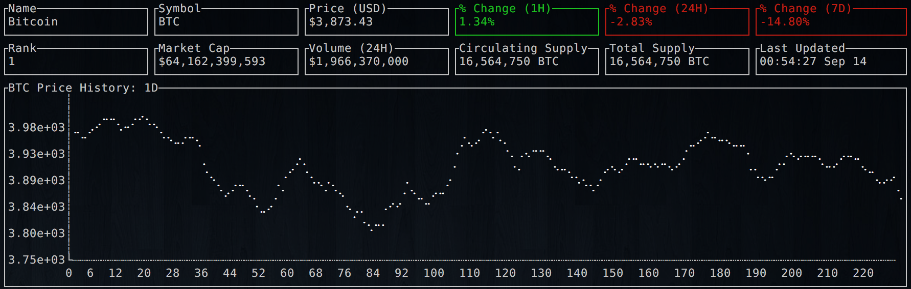
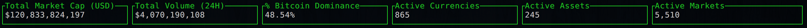
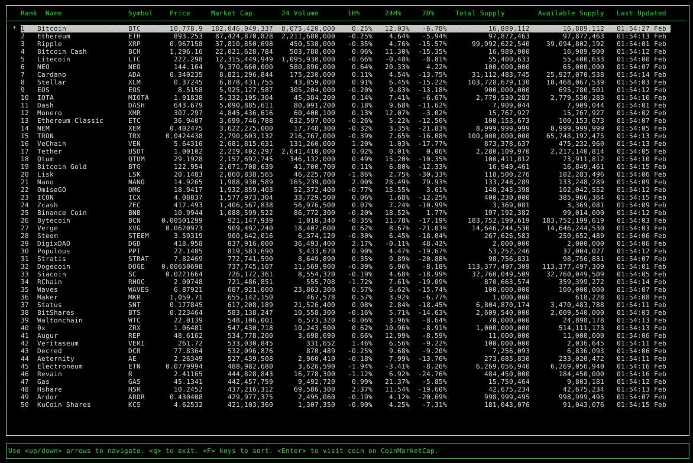

# cryptodash

> Cryptocurrency information and charts displayed in a dashboard from your terminal.



# Install

Make sure to have [golang](https://golang.org/) installed, then do:

```bash
go get -u github.com/miguelmota/cryptodash/cryptodash
```

# Usage

```text
$ cryptodash -help

  -chart-height uint
        Line chart height: .ie. 15 | 20 | 25 | 30 (default 20)
  -coin string
        Cryptocurrency name. ie. bitcoin | ethereum | litecoin | etc... (default "bitcoin")
  -color string
        Primary color. ie. green | cyan | magenta | red | yellow | white (default "green")
  -date string
        Chart date range. ie. 1h | 1d | 2d | 7d | 30d | 2w | 1m | 3m | 1y (default "7d")
  -global
        Show global market data.
  -limit uint
        Limit number of cryptocurrencies to return for table. ie. 10 | 25 | 50 | 100 (default 50)
  -table
        Show the top 50 cryptocurrencies in a table.
```

## Examples

### Chart

Here's an example of getting latest [Ethereum](https://www.ethereum.org/) stats, and chart data for the last 30 days:

```bash
$ cryptodash -coin ethereum -date 30d
```


Here's an example of how you can set the primary color for the dashboard:

```bash
$ cryptodash -coin bitcoin -date 1d -color white
```



Here's an example of displaying global market data only:

```bash
$ cryptodash -global
```



### Table

Here's an example of displaying the top 100 cryptocurrencies stats in a table:

```bash
$ cryptodash -table -limit 100 -color green
```



# FAQ

- Q: Where is the data from?

  - A: The data is from [Coin Market Cap](https://coinmarketcap.com/).

- Q: What coins does this support?

  - A: This supports any coin listed on [Coin Market Cap](https://coinmarketcap.com/).

- Q: How often is the data polled?

  - A: Data gets polled once every minute.

- Q: How can I get multiple dashboards at once?

  - A: Use a window multiplexer, such as [tmux](https://tmux.github.io/) or [screen](https://www.gnu.org/software/screen/).


# License

MIT
